# 🏗️ Documentação de Arquitetura

## Agentes de Integração Empresarial com Azure AI Foundry

Este documento fornece uma visão geral completa da arquitetura, decisões de design e detalhes de implementação dos padrões de integração empresarial usando agentes do Azure AI Foundry.

---

## Índice

1. [Visão Geral](#visão-geral)
2. [Princípios de Arquitetura](#princípios-de-arquitetura)
3. [Arquitetura do Sistema](#arquitetura-do-sistema)
4. [Componentes](#componentes)
5. [Padrões de Integração](#padrões-de-integração)
6. [Fluxo de Dados](#fluxo-de-dados)
7. [Arquitetura de Segurança](#arquitetura-de-segurança)
8. [Escalabilidade e Desempenho](#escalabilidade--desempenho)
9. [Arquitetura de Deploy](#arquitetura-de-deploy)
10. [Monitoramento e Observabilidade](#monitoramento--observabilidade)

---

## Visão Geral

### Propósito

Este sistema demonstra como **agentes do Azure AI Foundry** podem ser integrados em aplicações empresariais usando **Padrões de Integração Empresarial (EIP)** estabelecidos. Ao combinar capacidades cognitivas com padrões de integração comprovados, criamos soluções empresariais inteligentes, escaláveis e sustentáveis.

### Objetivos

- ✅ Demonstrar uso prático do SDK v2 do Azure AI Foundry
- ✅ Implementar quatro padrões essenciais de integração empresarial
- ✅ Fornecer soluções containerizadas prontas para produção
- ✅ Estabelecer comunicação padronizada via MCP
- ✅ Habilitar operações assíncronas e não-bloqueantes
- ✅ Facilitar escalonamento independente de componentes

---

## Princípios de Arquitetura

### 1. Acoplamento Fraco

Componentes se comunicam através do **Azure Event Hub** e da **camada MCP**, não diretamente:
- Publicadores não conhecem os assinantes
- Filtros não dependem de filtros adjacentes
- Processadores são independentes dos submissores de comandos

### 2. Alta Coesão

Cada padrão é autocontido:
- Lógica específica do padrão permanece na pasta do padrão
- Utilitários compartilhados em local comum
- Separação clara de responsabilidades

### 3. Assíncrono Primeiro

Todas as operações de I/O são assíncronas:
- Operações não-bloqueantes com Event Hub
- Processamento concorrente de agentes
- Execução paralela de pipelines

### 4. Aprimoramento Cognitivo

Agentes de IA adicionam inteligência:
- Processamento consciente de contexto
- Compreensão de linguagem natural
- Tomada de decisão adaptativa
- Aprendizado a partir de interações

### 5. Observável

Observabilidade embutida:
- Logging estruturado
- Rastreamento de status
- Coleta de métricas
- Tratamento de erros

---

## Arquitetura do Sistema

### Arquitetura de Alto Nível

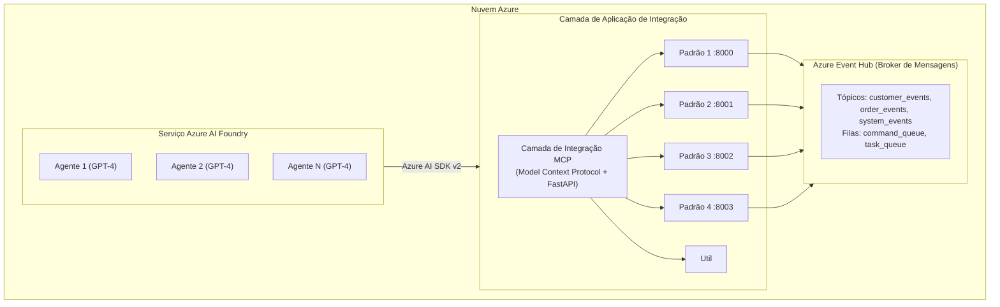

### Camadas de Componentes

#### Camada 1: Azure AI Foundry
- Hospeda agentes de IA com capacidades especializadas
- Fornece threads de conversação para contexto
- Executa processamento inteligente

#### Camada 2: Camada de Integração MCP
- Padroniza o protocolo de comunicação
- Fornece interface REST API
- Gerencia roteamento de mensagens
- Gerencia interações com agentes

#### Camada 3: Implementações de Padrões
- Quatro padrões de integração independentes
- Cada um com seu próprio servidor de API
- Containerizados para deploy
- Compartilham utilitários comuns

#### Camada 4: Broker de Mensagens
- Azure Event Hub para mensageria confiável
- Roteamento baseado em tópicos
- Distribuição de tarefas baseada em fila
- Entrega garantida

---

## Componentes

### Componentes Compartilhados

#### 1. Camada Base MCP (`shared/mcp/__init__.py`)

**Propósito:** Padronizar comunicação entre componentes

**Classes Principais:**
- `MCPMessage` - Formato de mensagem padronizado
- `MCPAdapter` - Adaptador abstrato de broker de mensagens
- `MCPRouter` - Roteia mensagens para handlers

**Padrão de Design:** Abstract Factory + Strategy

#### 2. FastAPI MCP (`shared/mcp/fastapi_mcp.py`)

**Propósito:** Servidor REST API para operações MCP

**Funcionalidades:**
- Endpoint de submissão de mensagens
- Registro de handlers
- Health checks
- Roteamento automático

**Alocação de Portas:**
- Padrão 1: 8000
- Padrão 2: 8001
- Padrão 3: 8002
- Padrão 4: 8003

#### 3. Utilitários de Agentes (`shared/utils/agent_utils.py`)

**Propósito:** Gerenciar agentes do Azure AI Foundry

**Funções:**
- `get_project_client()` - Inicializar cliente de IA
- `load_env_config()` - Carregar configuração
- `create_agent()` - Criar agentes especializados

#### 4. Utilitários de Event Hub (`shared/utils/eventhub_utils.py`)

**Propósito:** Gerenciar integração com Azure Event Hub

**Classe: EventHubAdapter**
- `send_event()` - Publicar mensagens
- `receive_events()` - Consumir mensagens
- Pool de conexões
- Checkpointing automático

---

## Padrões de Integração

### Padrão 1: Monitor e Executor de Fila de Mensagens

#### Arquitetura
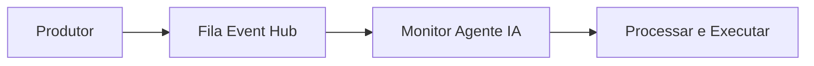

#### Componentes
- `MessageQueueAgent` - Monitora e processa mensagens da fila
- Servidor FastAPI para submissão de mensagens
- Event Hub para armazenamento em fila

#### Fluxo
1. Cliente envia tarefa para a API
2. Tarefa enfileirada no Event Hub
3. Agente consulta a fila
4. Agente processa com IA
5. Resultado armazenado e registrado

#### Casos de Uso
- Processamento de jobs em segundo plano
- Distribuição de tarefas
- Operações assíncronas

---

### Padrão 2: Pipes e Filtros

#### Arquitetura
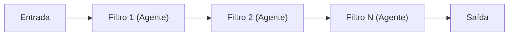

#### Componentes
- `CognitiveFilter` - Filtro alimentado por IA
- `Pipeline` - Orquestração sequencial
- `ParallelPipeline` - Execução concorrente
- `PipelineData` - Container de dados com metadados

#### Fluxo
1. Dados de entrada entram no pipeline
2. Cada filtro transforma os dados usando IA
3. Transformações são rastreadas
4. Saída final é retornada

#### Modos
- **Sequencial:** Filtros executam um após o outro
- **Paralelo:** Filtros executam simultaneamente

#### Casos de Uso
- Pipelines de transformação de dados
- Processamento de conteúdo em múltiplos estágios
- Operações ETL

---

### Padrão 3: Publish/Subscribe

#### Arquitetura
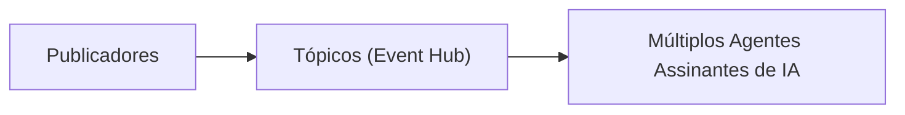

#### Componentes
- `AgentSubscriber` - Agente de IA que assina tópicos
- `PubSubBroker` - Gerencia assinaturas e roteamento
- `Message` - Mensagem baseada em tópico
- `TopicType` - Enum de tópicos disponíveis

#### Fluxo
1. Publicador envia mensagem para um tópico
2. Event Hub transmite para todos os assinantes
3. Agentes interessados processam em paralelo
4. Cada um fornece análise única

#### Tópicos
- `customer_events` - Interações com clientes
- `order_events` - Processamento de pedidos
- `system_events` - Operações do sistema
- `analytics_events` - Inteligência de negócios

#### Casos de Uso
- Microsserviços orientados a eventos
- Analytics em tempo real
- Processamento de eventos com múltiplos consumidores

---

### Padrão 4: Mensagens de Comando

#### Arquitetura
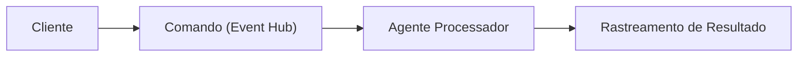

#### Componentes
- `CommandMessage` - Comando com parâmetros e status
- `CommandProcessor` - Agente de IA que executa comandos
- `AsyncCommandPipeline` - Orquestração assíncrona
- `CommandStatus` - Rastreamento de ciclo de vida

#### Fluxo
1. Cliente envia comando
2. Comando enfileirado com ID único
3. Processador pega o comando
4. Agente de IA executa
5. Status atualizado
6. Cliente consulta resultados

#### Tipos de Comando
- `process_data` - Operações com dados
- `analyze_content` - Análise de conteúdo
- `generate_report` - Criação de relatórios
- `validate_input` - Validação
- `transform_data` - Transformações

#### Casos de Uso
- Operações de longa duração
- Execução rastreável
- Comandos auditáveis
- Requisição/resposta assíncrona

---

## Fluxo de Dados

### Padrão de Fluxo de Mensagens

Todos os padrões seguem um fluxo de mensagens similar:

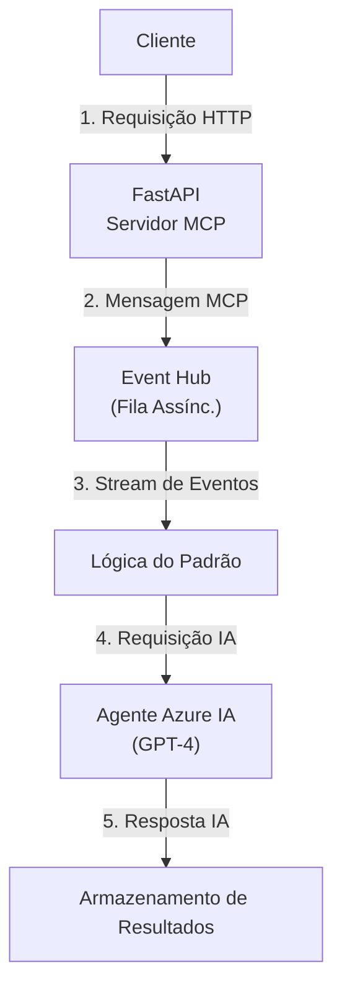

### Transformação de Dados

#### Padrão 1: Processamento de Fila
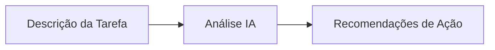

#### Padrão 2: Processamento em Pipeline
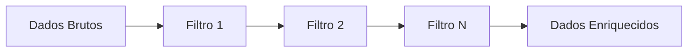

#### Padrão 3: Processamento Pub/Sub
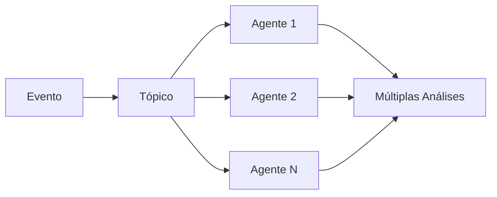

#### Padrão 4: Processamento de Comandos
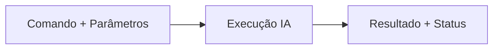

---

## Arquitetura de Segurança

### Autenticação e Autorização

1. **Azure Managed Identity**
   - Recomendado para produção
   - Sem armazenamento de credenciais
   - Renovação automática de tokens

2. **Connection Strings**
   - Desenvolvimento/testes
   - Armazenadas em variáveis de ambiente
   - Nunca commitadas no código-fonte

### Segurança de Rede

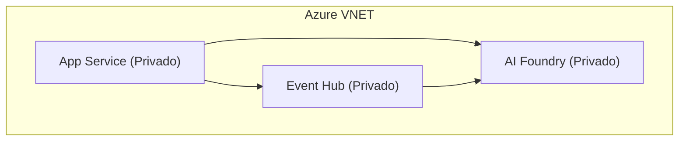

### Proteção de Dados

1. **Em Trânsito**
   - TLS 1.2+ para todas as conexões
   - Criptografia do Azure Event Hub
   - HTTPS para APIs

2. **Em Repouso**
   - Criptografia de armazenamento Azure
   - Criptografia de dados do Event Hub
   - Sem PII nos logs

### Melhores Práticas

- ✅ Use Azure Key Vault para segredos
- ✅ Habilite isolamento de rede
- ✅ Implemente acesso com menor privilégio
- ✅ Audite todas as operações
- ✅ Rotacione credenciais regularmente
- ✅ Monitore anomalias

---

## Escalabilidade e Desempenho

### Escalonamento Horizontal

Cada padrão escala independentemente:

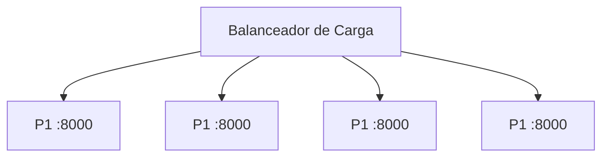

### Características de Desempenho

#### Padrão 1: Fila de Mensagens
- **Throughput:** ~1000 msgs/seg
- **Latência:** 100-500ms por mensagem
- **Gargalo:** Tempo de processamento do agente IA

#### Padrão 2: Pipes e Filtros
- **Sequencial:** Soma das latências dos filtros
- **Paralelo:** Latência máxima do filtro
- **Gargalo:** Filtro mais lento

#### Padrão 3: Pub/Sub
- **Fan-out:** Entrega de mensagem 1:N
- **Paralelo:** Todos os assinantes processam concorrentemente
- **Gargalo:** Throughput do Event Hub

#### Padrão 4: Comandos
- **Assíncrono:** Cliente não aguarda
- **Consulta de status:** Overhead mínimo
- **Gargalo:** Número de processadores

### Estratégias de Otimização

1. **Pool de Agentes**
   - Reutilizar threads de agentes
   - Reduzir tempo de cold start

2. **Processamento em Lote**
   - Agrupar operações do Event Hub
   - Reduzir chamadas de API

3. **Cache**
   - Cachear respostas de agentes
   - Reduzir processamento duplicado

4. **Pool de Conexões**
   - Reutilizar conexões
   - Reduzir overhead de handshake

---

## Arquitetura de Deploy

### Deploy em Containers

Cada padrão é implantado como um container:

```yaml
# docker-compose.yml
version: '3.8'
services:
  message-queue:
    build:
      context: .
      dockerfile: src/services/message_queue/Dockerfile
    ports:
      - "8000:8000"
    env_file: .env
    
  pipes-filters:
    build:
      context: .
      dockerfile: src/services/pipes_filters/Dockerfile
    ports:
      - "8001:8001"
    env_file: .env
    
  pubsub:
    build:
      context: .
      dockerfile: src/services/pubsub/Dockerfile
    ports:
      - "8002:8002"
    env_file: .env
    
  command-messages:
    build:
      context: .
      dockerfile: src/services/command_messages/Dockerfile
    ports:
      - "8003:8003"
    env_file: .env
```

### Deploy no Kubernetes

```yaml
# pattern-deployment.yaml
apiVersion: apps/v1
kind: Deployment
metadata:
  name: pattern-1
spec:
  replicas: 3
  selector:
    matchLabels:
      app: pattern-1
  template:
    metadata:
      labels:
        app: pattern-1
    spec:
      containers:
      - name: pattern-1
        image: myregistry/pattern-1:latest
        ports:
        - containerPort: 8000
        envFrom:
        - secretRef:
            name: azure-credentials
        resources:
          requests:
            cpu: 500m
            memory: 1Gi
          limits:
            cpu: 1000m
            memory: 2Gi
---
apiVersion: v1
kind: Service
metadata:
  name: pattern-1-service
spec:
  selector:
    app: pattern-1
  ports:
  - port: 8000
    targetPort: 8000
  type: LoadBalancer
```

### Azure Container Apps

Recomendado para deploy serverless:
- Escalonamento automático
- Infraestrutura gerenciada
- Balanceamento de carga embutido
- Precificação por uso

---

## Monitoramento e Observabilidade

### Estratégia de Logging

```python
import logging

# Logging estruturado
logger.info(
    "Processando mensagem",
    extra={
        "message_id": message.id,
        "pattern": "message-queue",
        "status": "processing",
        "duration_ms": 150,
    }
)
```

### Métricas Principais

#### Métricas da Aplicação
- Requisições por segundo
- Tempo de resposta (p50, p95, p99)
- Taxa de erros
- Tempo de processamento do agente

#### Métricas Específicas por Padrão
- Profundidade da fila (Padrão 1)
- Throughput do pipeline (Padrão 2)
- Contagem de assinantes (Padrão 3)
- Distribuição de status de comandos (Padrão 4)

### Stack de Monitoramento

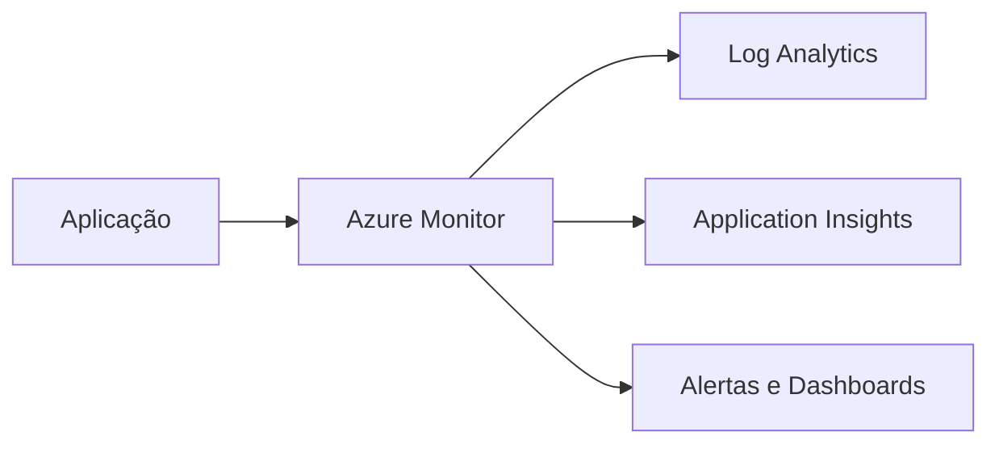

### Health Checks

Cada padrão implementa:
- `/health` - Saúde básica
- `/ready` - Sonda de prontidão
- `/live` - Sonda de vivacidade

---

## Conclusão

Esta arquitetura fornece:
- ✅ **Escalável** - Cada componente escala independentemente
- ✅ **Resiliente** - Isolamento de falhas entre padrões
- ✅ **Observável** - Logging e métricas completos
- ✅ **Segura** - Melhores práticas Azure
- ✅ **Sustentável** - Separação clara de responsabilidades
- ✅ **Cognitiva** - Processamento aprimorado por IA

A combinação de padrões comprovados de integração empresarial com capacidades modernas de IA cria uma base poderosa para construir aplicações empresariais inteligentes.
