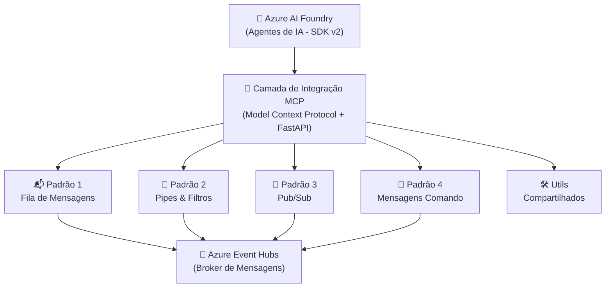

# 🚀 Reactor Enterprise Integration Agents

Um repositório completo demonstrando **Padrões de Integração Empresarial** usando **Agentes do Azure AI Foundry (SDK v2)** e **Azure Event Hubs**.

Este repositório contém exemplos completos e prontos para produção de quatro padrões essenciais de integração empresarial, cada um aprimorado com **capacidades cognitivas** de agentes de IA.

## 🎯 O Que Tem Aqui?

Quatro padrões de integração distintos, cada um em sua própria pasta com:
- ✅ Código-fonte completo com integração Azure AI Foundry
- ✅ Dockerfile (imagens base + desenvolvimento)
- ✅ Camada de integração MCP (Model Context Protocol)
- ✅ Endpoints REST API com FastAPI
- ✅ README completo no estilo de apresentação YouTube
- ✅ Casos de uso e exemplos do mundo real

## 🏗️ Visão Geral da Arquitetura



## 📁 Estrutura do Repositório

```
reactor-enterprise-integration-agents/
├── src/                             # Código-fonte principal
│   ├── agents/                     # Classes base de agentes
│   │   ├── __init__.py
│   │   └── base_agent.py          # Agente base reutilizável
│   ├── shared/                     # Utilitários compartilhados
│   │   ├── mcp/                   # Camada de integração MCP
│   │   │   ├── __init__.py        # Classes base MCP
│   │   │   └── fastapi_mcp.py     # Servidor MCP FastAPI
│   │   ├── utils/                 # Utilitários comuns
│   │   │   ├── agent_utils.py     # Gerenciamento de agentes
│   │   │   └── eventhub_utils.py  # Integração com Event Hub
│   │   ├── azure_clients.py       # Clientes Azure
│   │   └── models.py              # Modelos de dados
│   ├── patterns/                   # Implementações dos padrões (biblioteca)
│   │   ├── message_queue/         # Lógica do padrão Fila
│   │   ├── pipes_and_filters/     # Lógica do padrão Pipes
│   │   ├── pubsub/                # Lógica do padrão Pub/Sub
│   │   └── command_messages/      # Lógica do padrão Comandos
│   └── services/                   # Serviços FastAPI standalone
│       ├── message_queue/         # Serviço Fila de Mensagens
│       ├── pipes_filters/         # Serviço Pipes e Filtros
│       ├── pubsub/                # Serviço Pub/Sub
│       └── command_messages/      # Serviço Mensagens de Comando
├── examples/                       # Scripts de exemplo
├── tests/                          # Testes automatizados
├── docs/                           # Documentação adicional
├── ARCHITECTURE.md                 # Guia detalhado de arquitetura
├── pyproject.toml                  # Configuração do projeto e dependências
├── uv.lock                         # Lockfile de dependências (uv)
├── docker-compose.yml              # Orquestração de containers
├── .env.example                    # Template de variáveis de ambiente
└── README.md                       # Este arquivo
```

## 🎓 Os Quatro Padrões

### 1️⃣ Monitor e Executor de Fila de Mensagens
**Porta: 8000** | [📖 Documentação](src/services/message_queue/README.md)

Agentes de IA monitoram filas de mensagens e processam tarefas de forma inteligente. Perfeito para:
- Distribuição e processamento de tarefas
- Gerenciamento de filas de trabalho
- Processamento de jobs em segundo plano

### 2️⃣ Pipes e Filtros com Capacidades Cognitivas
**Porta: 8001** | [📖 Documentação](src/services/pipes_filters/README.md)

Pipeline de processamento sequencial ou paralelo onde cada filtro é um agente de IA. Perfeito para:
- Pipelines de transformação de dados
- Fluxos de processamento de conteúdo
- Análise em múltiplas etapas

### 3️⃣ Publish/Subscribe com Assinantes de IA
**Porta: 8002** | [📖 Documentação](src/services/pubsub/README.md)

Arquitetura orientada a eventos com agentes de IA como assinantes inteligentes. Perfeito para:
- Microsserviços orientados a eventos
- Análises em tempo real
- Processamento de eventos com múltiplos consumidores

### 4️⃣ Mensagens de Comando com Pipelines Assíncronos
**Porta: 8003** | [📖 Documentação](src/services/command_messages/README.md)

Arquitetura orientada a comandos com execução assíncrona. Perfeito para:
- Operações de longa duração
- Execução de comandos rastreáveis
- Requisição/resposta assíncrona

## 🚀 Início Rápido

### Pré-requisitos

1. **Serviços Azure:**
   - Projeto Azure AI Foundry com modelo implantado
   - Namespace e hub do Azure Event Hub

2. **Ambiente Local:**
   - Python 3.11+
   - Docker (opcional)

### Instalação

1. **Clone o repositório:**
```bash
git clone https://github.com/Cataldir/reactor-enterprise-integration-agents.git
cd reactor-enterprise-integration-agents
```

2. **Configure o ambiente:**
```bash
cp .env.example .env
# Edite o .env com suas credenciais Azure
```

3. **Instale as dependências:**
```bash
uv sync
```

### Executando Padrões Individualmente

Cada padrão pode ser executado independentemente:

```bash
# Padrão 1: Fila de Mensagens
cd src/services/message_queue
python api.py  # Inicia na porta 8000

# Padrão 2: Pipes e Filtros
cd src/services/pipes_filters
python api.py  # Inicia na porta 8001

# Padrão 3: Pub/Sub
cd src/services/pubsub
python api.py  # Inicia na porta 8002

# Padrão 4: Mensagens de Comando
cd src/services/command_messages
python api.py  # Inicia na porta 8003
```

### Usando Docker

Cada padrão tem seu próprio Dockerfile:

```bash
# Construir padrão (exemplo para o Padrão 1)
docker build -t message-queue-agent --target production -f src/services/message_queue/Dockerfile .

# Executar com arquivo de ambiente
docker run --env-file .env -p 8000:8000 message-queue-agent
```

## 🔧 Configuração

Todos os padrões usam as mesmas variáveis de ambiente:

```bash
# Azure AI Foundry
AZURE_AI_PROJECT_ENDPOINT=https://<resource>.services.ai.azure.com/api/projects/<project>

# Azure Event Hub
EVENTHUB_CONNECTION_STRING=sua_conexao_eventhub
EVENTHUB_NAME=nome_do_seu_hub

# Configuração do Modelo
MODEL_DEPLOYMENT_NAME=gpt-4

# Logging
LOG_LEVEL=INFO
```

## 📚 Tecnologias Principais

- **Azure AI Foundry (SDK v2)** - Agentes de IA inteligentes
- **Azure Event Hubs** - Broker de mensagens empresarial
- **FastAPI** - Framework web moderno
- **MCP (Model Context Protocol)** - Comunicação padronizada de IA
- **Python 3.11+** - Python moderno e assíncrono
- **Docker** - Containerização

## 🎯 Casos de Uso por Indústria

### 🏦 Serviços Financeiros
- Processamento de transações (Fila)
- Pipeline de detecção de fraudes (Pipes & Filtros)
- Monitoramento de risco em tempo real (Pub/Sub)
- Operações de conta (Comandos)

### 🛒 E-Commerce
- Processamento de pedidos (Fila)
- Enriquecimento de dados de produtos (Pipes & Filtros)
- Atualizações de estoque (Pub/Sub)
- Ações de clientes (Comandos)

### 🏥 Saúde
- Processamento de prontuários (Fila)
- Análise de dados médicos (Pipes & Filtros)
- Distribuição de alertas (Pub/Sub)
- Protocolos de tratamento (Comandos)

### 📱 IoT/Dispositivos Inteligentes
- Processamento de dados de sensores (Fila)
- Transformação de dados (Pipes & Filtros)
- Tratamento de eventos de dispositivos (Pub/Sub)
- Controle de dispositivos (Comandos)

## 🔐 Melhores Práticas de Segurança

1. ✅ Use Azure Managed Identity
2. ✅ Armazene segredos no Azure Key Vault
3. ✅ Habilite isolamento de rede
4. ✅ Implemente autenticação adequada
5. ✅ Monitore e audite acessos
6. ✅ Use o princípio do menor privilégio

## 📖 Documentação

- [Guia de Arquitetura](ARCHITECTURE.md) - Arquitetura detalhada do sistema
- [Guia do Padrão 1](src/services/message_queue/README.md) - Fila de Mensagens
- [Guia do Padrão 2](src/services/pipes_filters/README.md) - Pipes e Filtros
- [Guia do Padrão 3](src/services/pubsub/README.md) - Pub/Sub
- [Guia do Padrão 4](src/services/command_messages/README.md) - Mensagens de Comando

## 🤝 Contribuindo

Este é um repositório educacional para demonstrar padrões de integração empresarial. Fique à vontade para:
- Abrir issues para perguntas
- Enviar PRs para melhorias
- Compartilhar seus casos de uso
- Fornecer feedback

## 📺 Conteúdo YouTube

Este repositório acompanha a série no YouTube **"Deep Dive em Integrações Empresariais para Aplicações de AI"**. O README de cada padrão é escrito em estilo de apresentação adequado para conteúdo em vídeo.

## 📄 Licença

[Licença MIT](LICENSE)

## 🙏 Agradecimentos

Construído com:
- Azure AI Foundry
- Azure Event Hubs
- FastAPI
- Comunidade Python

---

**🔗 Links Úteis:**
- [Documentação do Azure AI Foundry](https://learn.microsoft.com/azure/ai-studio/)
- [Documentação do Azure Event Hubs](https://learn.microsoft.com/azure/event-hubs/)
- [Padrões de Integração Empresarial](https://www.enterpriseintegrationpatterns.com/)
- [Documentação do FastAPI](https://fastapi.tiangolo.com/)

**#AzureAI #IntegraçãoEmpresarial #AgentesDeIA #Python #CloudComputing #Microsserviços**
