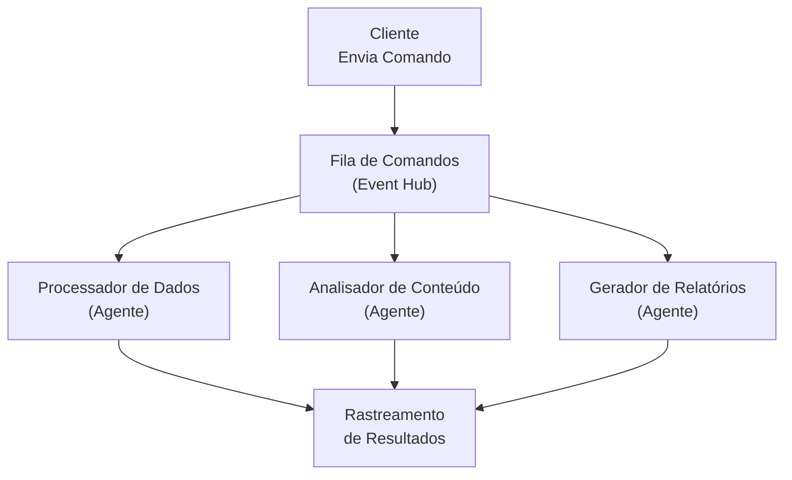

# 🎬 Padrão 4: Mensagens de Comando com Pipelines Assíncronos

## 📺 Estilo de Apresentação YouTube

E aí, arquitetos! 👨‍💻 Prontos para o ÚLTIMO padrão? É aqui que a **arquitetura orientada a comandos encontra a inteligência artificial**! Vamos construir **Mensagens de Comando com Pipelines Assíncronos**!

## 🎯 O Que São Mensagens de Comando?

Pense como se estivesse **dando ordens** ao seu sistema:
- 📋 **Comandos** - Ações específicas a executar
- 🤖 **Processadores de IA** - Executores inteligentes de comandos
- ⚡ **Processamento Assíncrono** - Execução não-bloqueante
- 📊 **Rastreamento de Status** - Monitoramento de progresso em tempo real

Comandos não são apenas dados - são **instruções acionáveis**! 🎯

## 🏗️ Visão Geral da Arquitetura



## 🔥 O Padrão de Integração Empresarial

O padrão **Mensagem de Comando** possui:

1. **Comando** - Instrução explícita com parâmetros
2. **Processador** - Agente que executa o comando
3. **Execução Assíncrona** - Processamento não-bloqueante e paralelo
4. **Atualizações de Status** - Rastrear ciclo de vida do comando
5. **Recuperação de Resultados** - Obter resultados quando prontos

### Por Que o Padrão de Comando é Incrível! 🎸

- ✅ **Orientado a Intenção** - Comandos expressam intenção clara
- ✅ **Rastreável** - Todo comando tem um ID e status
- ✅ **Auditável** - Histórico completo de comandos
- ✅ **Assíncrono** - Não espere por operações longas
- ✅ **Escalável** - Adicione processadores sem alterar submissores

## 🛠️ Tecnologias Utilizadas

- **Azure Event Hub** - Fila de comandos ⚡
- **Agentes Azure AI Foundry** - Processadores de comandos 🤖
- **Python Assíncrono** - Execução não-bloqueante 🚀
- **FastAPI + MCP** - API REST com rastreamento de status 📡
- **Padrão Command** - Separação limpa de responsabilidades 🎯

## 🚀 Início Rápido

### Pré-requisitos

1. Azure Event Hub configurado
2. Projeto Azure AI Foundry
3. Python 3.11+

### Configuração

1. **Navegue:**
```bash
cd src/services/command_messages
```

2. **Configure:**
```bash
cp ../.env.example .env
# Adicione as credenciais
```

3. **Instale:**
```bash
uv sync
```

### 🏃 Executando

**Opção 1: Demo**
```bash
python main.py
```

**Opção 2: API REST**
```bash
python api.py
# OU
uvicorn api:app --port 8003 --reload
```

### 🐳 Docker

**Construir:**
```bash
# Produção
docker build -t command-messages-agent --target production .

# Desenvolvimento
docker build -t command-messages-agent-dev --target development .
```

**Executar:**
```bash
# Produção
docker run --env-file .env command-messages-agent

# Desenvolvimento
docker run -p 8003:8003 -v $(pwd):/app/src/services/command_messages --env-file .env command-messages-agent-dev
```

## 📡 Endpoints da API

### Enviar Comando
```bash
POST /commands/submit
{
  "command_type": "process_data",
  "parameters": {
    "data": [1, 2, 3, 4, 5],
    "operation": "calculate_statistics"
  },
  "metadata": {
    "priority": "high"
  }
}

Resposta:
{
  "command_id": "uuid-aqui",
  "command_type": "process_data",
  "status": "pending",
  "created_at": "2024-01-01T00:00:00"
}
```

### Verificar Status do Comando
```bash
GET /commands/{command_id}

Resposta:
{
  "command_id": "uuid",
  "command_type": "process_data",
  "status": "completed",
  "result": {
    "processor": "Processador de Dados",
    "response": "Estatísticas calculadas...",
    "execution_time": "2024-01-01T00:00:05"
  },
  "error": null,
  "created_at": "2024-01-01T00:00:00",
  "updated_at": "2024-01-01T00:00:05"
}
```

### Criar Processador Personalizado
```bash
POST /processors/create
{
  "name": "Processador Personalizado",
  "command_types": ["process_data"],
  "instructions": "Processar dados de acordo com..."
}
```

### Criar Processadores Pré-configurados
```bash
POST /processors/preset/data-processor
POST /processors/preset/content-analyzer
POST /processors/preset/report-generator
POST /processors/preset/validator
```

### Listar Processadores
```bash
GET /processors
```

### Iniciar Pipeline
```bash
POST /pipeline/start
```

### Listar Tipos de Comando
```bash
GET /command-types
```

## 💡 Como Funciona

### 1. Tipos de Comando
Cinco tipos de comando disponíveis:
- `process_data` - Operações de processamento de dados
- `analyze_content` - Análise de conteúdo
- `generate_report` - Geração de relatórios
- `validate_input` - Validação de entrada
- `transform_data` - Transformação de dados

### 2. Submissão de Comando
Cliente envia o comando:
```python
command = CommandMessage(
    command_id=uuid.uuid4(),
    command_type=CommandType.PROCESS_DATA,
    parameters={"data": [...], "operation": "..."},
)
await pipeline.submit_command(command)
```

### 3. Processamento Assíncrono
- Comando enfileirado no Event Hub
- Pipeline o captura
- Roteia para o processador apropriado
- Processador executa usando IA
- Status atualizado em tempo real

### 4. Recuperação de Resultados
- Consulte o endpoint de status do comando
- Obtenha resultados quando concluído
- Trate erros se falhar

## 🎓 Conceitos-Chave

### CommandMessage
Especificação completa do comando:
- **command_id** - Identificador único
- **command_type** - O que fazer
- **parameters** - Como fazer
- **status** - Estado atual
- **result** - Resultado da execução

### CommandProcessor
Executor alimentado por IA:
- Trata tipos específicos de comando
- Usa agente de IA para inteligência
- Atualiza status do comando
- Retorna resultados estruturados

### AsyncCommandPipeline
Camada de orquestração:
- Recebe comandos
- Roteia para processadores
- Rastreia status
- Gerencia comunicação com Event Hub

## 📊 Casos de Uso do Mundo Real

Perfeito para:

1. 📄 **Processamento de Documentos**
   - Comando: "process_document"
   - Params: document_id, operations
   - Resultado: Documento processado

2. 🔍 **Operações de Busca**
   - Comando: "search_content"
   - Params: query, filters
   - Resultado: Resultados da busca

3. 📧 **Campanhas de E-mail**
   - Comando: "send_campaign"
   - Params: recipients, template
   - Resultado: Status de envio

4. 📊 **Geração de Relatórios**
   - Comando: "generate_report"
   - Params: data_source, format
   - Resultado: Relatório gerado

5. 🔄 **Migração de Dados**
   - Comando: "migrate_data"
   - Params: source, destination
   - Resultado: Status da migração

## 🎯 Funcionalidades Avançadas

### Ciclo de Vida do Status do Comando
```
PENDENTE → PROCESSANDO → CONCLUÍDO
                      ↓
                   FALHOU
```

### Múltiplos Processadores por Tipo
Múltiplos agentes podem tratar o mesmo tipo de comando:
- Balanceamento de carga
- Redundância
- Especialização

### Metadados do Comando
Rastrear contexto adicional:
- Níveis de prioridade
- Informações do usuário
- IDs de correlação
- Tags e rótulos

### Tratamento de Erros
Gerenciamento robusto de erros:
- Lógica de retry automático
- Filas de mensagens mortas (dead letter)
- Notificações de erro
- Mensagens de erro detalhadas

## 🔐 Melhores Práticas

1. ✅ **Idempotência** - Comandos podem ser retentados com segurança
2. ✅ **Timeouts** - Defina limites de tempo de execução
3. ✅ **Validação** - Valide parâmetros antes do processamento
4. ✅ **Logging** - Rastreie todas as execuções de comandos
5. ✅ **Monitoramento** - Alerte sobre falhas e comandos lentos

## 📈 Monitoramento e Métricas

Rastreie métricas principais:
- Comandos enviados por tipo
- Tempo médio de processamento
- Taxas de sucesso/falha
- Utilização de processadores
- Profundidade da fila

```python
processor_info = {
    "name": processor.name,
    "command_types": processor.command_types,
    "processed_count": processor.processed_commands,
}
```

## 🆚 Padrões Comando vs Evento

| Aspecto | Comando | Evento |
|---------|---------|--------|
| **Intenção** | Fazer algo | Algo aconteceu |
| **Direção** | Ponto-a-ponto | Broadcast |
| **Resposta** | Esperada | Opcional |
| **Rastreamento** | Por ID | Por correlação |

## 🎬 Encerramento da Série!

Cobrimos todos os 4 padrões:
1. ✅ **Fila de Mensagens** - Monitoramento inteligente
2. ✅ **Pipes e Filtros** - Transformações cognitivas
3. ✅ **Pub/Sub** - Agentes orientados a eventos
4. ✅ **Mensagens de Comando** - Execução assíncrona de comandos

## 🙏 Obrigado!

Você chegou até o final! 🎉

- 👍 Curta se você aprendeu algo
- 💬 Comente seu padrão favorito
- 📢 Compartilhe a série inteira
- 🔔 Inscreva-se para mais!

---

**🔗 Recursos:**
- [Padrão Command Message](https://www.enterpriseintegrationpatterns.com/patterns/messaging/CommandMessage.html)
- [Azure Event Hubs](https://learn.microsoft.com/azure/event-hubs/)
- [Azure AI Foundry](https://learn.microsoft.com/azure/ai-studio/)
- [Python Assíncrono](https://docs.python.org/3/library/asyncio.html)

**#PadrãoCommand #ProgramaçãoAssíncrona #AgentesDeIA #AzureAI #IntegraçãoEmpresarial**
