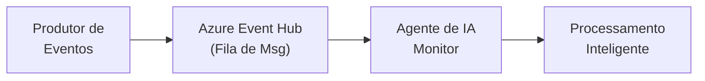

# 🎬 Padrão 1: Monitor e Executor de Fila de Mensagens com Agentes de IA

## 📺 Estilo de Apresentação YouTube

E aí, pessoal! 👋 Bem-vindos de volta ao canal! Hoje vamos mergulhar em algo MUITO empolgante - **processamento inteligente de filas de mensagens usando Agentes do Azure AI Foundry**!

## 🎯 O Que Estamos Construindo?

Imagine ter um agente de IA que pode **monitorar e processar de forma inteligente** suas filas de mensagens. Chega de consumidores burros! Estamos falando de agentes que podem:

- 🧠 **Compreender** o contexto de cada mensagem
- 🎯 **Analisar** os requisitos da tarefa
- 🚀 **Recomendar** estratégias de processamento ideais
- ⚠️ **Identificar** problemas potenciais antes que aconteçam

## 🏗️ Visão Geral da Arquitetura



## 🔥 O Padrão de Integração Empresarial

Isso implementa o **Padrão de Fila de Mensagens** com um toque cognitivo:

1. **Produtor** envia mensagens para o Azure Event Hub
2. **Agente de IA** monitora a fila continuamente
3. **Processamento Inteligente** - O agente analisa cada mensagem usando o Azure AI Foundry
4. **Execução de Ações** - Com base nas recomendações do agente
5. **Loop de Feedback** - Resultados registrados e monitorados

## 🛠️ Tecnologias Utilizadas

- **Azure AI Foundry** (SDK v2) - O cérebro do nosso sistema! 🧠
- **Azure Event Hub** - Fila de mensagens de nível empresarial 📬
- **FastAPI** - API REST ultrarrápida ⚡
- **Camada MCP** - Model Context Protocol para comunicação padronizada 🔗
- **Python 3.11+** - Python moderno e assíncrono 🐍

## 🚀 Início Rápido

### Pré-requisitos

1. Projeto Azure AI Foundry
2. Namespace e hub do Azure Event Hub
3. Python 3.11+

### Configuração

1. **Clone e navegue:**
```bash
cd src/services/message_queue
```

2. **Configure o ambiente:**
```bash
cp ../.env.example .env
# Edite o .env com suas credenciais do Azure
```

3. **Instale as dependências:**
```bash
uv sync
```

### 🏃 Executando a Aplicação

**Opção 1: Monitoramento Direto (Console)**
```bash
python main.py
```

**Opção 2: Modo API REST**
```bash
python api.py
# OU
uvicorn api:app --reload
```

### 🐳 Usando Docker

**Construir e executar:**
```bash
# Modo produção
docker build -t message-queue-agent --target production .
docker run --env-file .env message-queue-agent

# Modo desenvolvimento com hot reload
docker build -t message-queue-agent-dev --target development .
docker run -p 8000:8000 -v $(pwd):/app/src/services/message_queue --env-file .env message-queue-agent-dev
```

## 📡 Endpoints da API

### Enviar Mensagem para a Fila
```
POST /queue/send
{
  "task": "Processar pedido do cliente",
  "data": {
    "order_id": "12345",
    "customer": "João Silva",
    "items": ["item1", "item2"]
  },
  "priority": 1
}
```

### Iniciar Monitor do Agente
```
POST /agent/start
```

### Verificar Status do Agente
```bash
GET /agent/status
```

### Verificação de Saúde
```bash
GET /health
```

## 💡 Como Funciona

### 1. Produção de Mensagens
As mensagens são enviadas ao Azure Event Hub com descrição da tarefa e dados:

```python
{
  "task": "Analisar sentimento do cliente",
  "data": {
    "customer_id": "C123",
    "feedback": "Ótimo serviço!"
  }
}
```

### 2. Processamento do Agente de IA
O agente:
1. Recebe a mensagem
2. Cria um prompt cognitivo
3. Usa o Azure AI Foundry para analisar
4. Retorna recomendações estruturadas

### 3. Análise Inteligente
O agente fornece:
- Compreensão da tarefa
- Recomendações de processamento
- Identificação de riscos
- Resultados esperados

## 🎓 Conceitos-Chave

### Integração MCP
Usa o **Model Context Protocol** para padronizar a comunicação entre:
- Brokers de mensagens (Event Hub)
- Agentes de IA (Azure AI Foundry)
- Camada de aplicação (FastAPI)

### Processamento Assíncrono
Tudo roda de forma assíncrona para máximo throughput:
```python
async def process_message(event: EventData) -> Dict[str, Any]:
    # Processamento de mensagem não-bloqueante
    result = await agent.analyze(event)
    return result
```

## 📊 Casos de Uso

Perfeito para:
- 📝 **Processamento de Documentos** - Roteamento e análise inteligente
- 🛒 **Gestão de Pedidos** - Validação e processamento inteligente de pedidos
- 📧 **Triagem de E-mails** - Categorização e resposta automatizada
- 🔍 **Análise de Logs** - Detecção inteligente de erros
- 🎫 **Tickets de Suporte** - Classificação automatizada de tickets

## 🔐 Melhores Práticas de Segurança

- ✅ Use Azure Managed Identity sempre que possível
- ✅ Armazene credenciais no Azure Key Vault
- ✅ Nunca faça commit de arquivos `.env`
- ✅ Use isolamento de rede para o Event Hub
- ✅ Habilite monitoramento e alertas

## 📈 Monitoramento e Observabilidade

O sistema registra:
- Status do processamento de mensagens
- Respostas do agente
- Condições de erro
- Métricas de desempenho

Verificar logs:
```bash
# No modo console
python main.py

# No modo API
tail -f uvicorn.log
```

## 🎬 Próximos Passos

Nos próximos padrões, vamos explorar:
- **Padrão 2**: Pipes e Filtros com capacidades cognitivas
- **Padrão 3**: Pub/Sub com múltiplos agentes
- **Padrão 4**: Mensagens de Comando em pipelines assíncronos

## 🙏 Obrigado por Assistir!

Se você achou útil:
- 👍 Deixe um like
- 📢 Compartilhe com sua equipe
- 💬 Comente com suas dúvidas
- 🔔 Inscreva-se para mais padrões de IA empresarial!

---

**🔗 Links:**
- [Documentação do Azure AI Foundry](https://learn.microsoft.com/azure/ai-studio/)
- [Documentação do Azure Event Hub](https://learn.microsoft.com/azure/event-hubs/)
- [Padrões de Integração Empresarial](https://www.enterpriseintegrationpatterns.com/)

**#AzureAI #IntegraçãoEmpresarial #AgentesDeIA #Python #CloudComputing**
