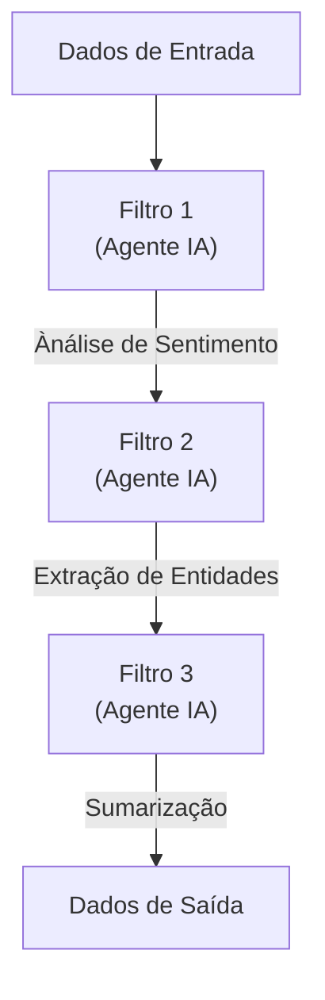
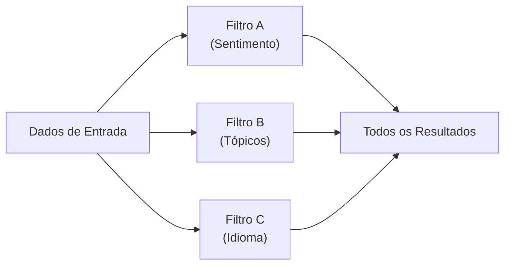

# 🎬 Padrão 2: Pipes and Filters com Capacidades Cognitivas

## 📺 Estilo de Apresentação YouTube

E aí, arquitetos de cloud! 🚀 Hoje vamos explorar um dos padrões de integração empresarial MAIS legais - **Pipes and Filters com superpoderes de IA**!

## 🎯 Sobre o Que é Este Padrão?

Pense como uma **linha de montagem para dados**, mas em vez de robôs, temos **agentes de IA** em cada estação! Cada agente:
- 🔍 **Analisa** os dados
- 🎨 **Transforma** de forma inteligente  
- 🎯 **Passa** para o próximo agente
- 🧠 **Aprende** com o contexto

## 🏗️ Visão Geral da Arquitetura



### 🌟 Opção de Pipeline Paralelo



## 🔥 O Padrão de Integração Empresarial

**Pipes and Filters** é um padrão clássico onde:

1. **Filtros** - Unidades de processamento independentes (nossos agentes de IA!)
2. **Pipes** - Canais de fluxo de dados entre filtros
3. **Sequencial** - Processa um após o outro
4. **Paralelo** - Processa simultaneamente para maior velocidade

### Por Que Filtros com IA São Incríveis! 🎸

- ✅ **Cientes do Contexto** - Agentes entendem o que estão processando
- ✅ **Flexíveis** - Fácil adicionar/remover/reordenar filtros
- ✅ **Escaláveis** - Cada filtro pode escalar independentemente
- ✅ **Reutilizáveis** - Filtros podem ser usados em múltiplos pipelines
- ✅ **Manuteníveis** - Altere um filtro sem afetar os outros

## 🛠️ Tecnologias Utilizadas

- **Agentes Azure AI Foundry** - Cada filtro é um agente de IA 🤖
- **FastAPI** - API REST para execução de pipelines 🚀
- **Python Assíncrono** - Processamento concorrente e não-bloqueante ⚡
- **Camada MCP** - Protocolo de comunicação padronizado 🔗
- **Pydantic** - Validação e serialização de dados ✅

## 🚀 Início Rápido

### Pré-requisitos

1. Projeto Azure AI Foundry configurado
2. Python 3.11+
3. Variáveis de ambiente configuradas

### Configuração

1. **Navegue até o padrão:**
```bash
cd src/services/pipes_filters
```

2. **Configure o ambiente:**
```bash
cp ../.env.example .env
# Edite com suas credenciais
```

3. **Instale as dependências:**
```bash
uv sync
```

### 🏃 Executando a Aplicação

**Opção 1: Script de Demonstração**
```bash
python main.py
```

**Opção 2: API REST**
```bash
python api.py
# OU
uvicorn api:app --port 8001 --reload
```

### 🐳 Deploy com Docker

**Construir:**
```bash
# Produção
docker build -t pipes-filters-agent --target production .

# Desenvolvimento
docker build -t pipes-filters-agent-dev --target development .
```

**Executar:**
```bash
# Produção
docker run --env-file .env pipes-filters-agent

# Desenvolvimento com hot reload
docker run -p 8001:8001 -v $(pwd):/app/src/services/pipes_filters --env-file .env pipes-filters-agent-dev
```

## 📡 Endpoints da API

### Executar Pipeline Personalizado
```bash
POST /pipeline/execute
{
  "input_data": "Seu texto aqui...",
  "filters": [
    {
      "name": "Analisador de Sentimento",
      "instructions": "Analisar sentimento..."
    },
    {
      "name": "Extrator de Entidades",
      "instructions": "Extrair entidades..."
    }
  ],
  "parallel": false
}
```

### Preset: Pipeline de Análise de Texto
```bash
POST /pipeline/preset/text-analysis
{
  "input_text": "Microsoft anunciou o Azure AI Foundry hoje..."
}
```

### Preset: Análise Paralela
```bash
POST /pipeline/preset/parallel-analysis
{
  "input_text": "Seu texto para processamento paralelo..."
}
```

### Verificação de Saúde
```bash
GET /health
```

## 💡 Como Funciona

### Pipeline Sequencial

1. **Entrada** entra no pipeline
2. **Filtro 1** processa e transforma
3. **Filtro 2** recebe a saída do Filtro 1
4. **Filtro 3** recebe a saída do Filtro 2
5. **Saída final** é retornada

Cada filtro agrega valor e contexto!

### Pipeline Paralelo

1. **Entrada** é copiada para todos os filtros
2. **Todos os filtros** processam simultaneamente
3. **Resultados** são coletados juntos
4. **Todas as saídas** retornadas como array

Perfeito para análises independentes!

## 🎓 Conceitos-Chave

### Classe CognitiveFilter
Cada filtro é um agente de IA que:
- Possui instruções específicas
- Mantém contexto de conversação
- Processa dados de forma inteligente
- Registra transformações

```python
filter = CognitiveFilter(
    name="Analisador de Sentimento",
    project_client=client,
    agent_id=agent_id,
    instructions="Analisar sentimento..."
)
```

### Composição de Pipeline
Construa pipelines de forma fluente:
```python
pipeline = Pipeline("Meu Pipeline")
    .add_filter(filter1)
    .add_filter(filter2)
    .add_filter(filter3)

result = await pipeline.execute(data)
```

### PipelineData
Transporta informações pelo pipeline:
- **content** - Os dados reais
- **metadata** - Informações de processamento
- **transformations** - Trilha de auditoria

## 📊 Casos de Uso do Mundo Real

Perfeito para:

1. 📄 **Processamento de Documentos**
   - Extrair → Classificar → Resumir → Armazenar

2. 📧 **Processamento de E-mails**
   - Analisar → Sentimento → Prioridade → Rotear

3. 🎥 **Moderação de Conteúdo**
   - Detectar → Analisar → Pontuar → Ação

4. 📊 **Enriquecimento de Dados**
   - Limpar → Validar → Enriquecer → Formatar

5. 🔍 **Análise de Logs**
   - Analisar → Detectar Padrões → Alertar → Arquivar

## 🎯 Funcionalidades Avançadas

### Instruções Personalizadas de Filtro
Personalize o comportamento de cada filtro:
```python
FilterConfig(
    name="Analisador Personalizado",
    instructions="""
    Você é um analisador especialista.
    Foque em: X, Y, Z
    Formato de saída: JSON
    """
)
```

### Tratamento de Erros
Pipelines continuam mesmo se um filtro falhar:
- Filtros com falha são registrados em log
- Metadados rastreiam o status
- Filtros subsequentes recebem a última saída válida

### Otimização de Desempenho
- Use pipelines paralelos para tarefas independentes
- Reutilize threads de agentes para múltiplas execuções
- Execução assíncrona em todo o fluxo

## 🔐 Melhores Práticas

1. ✅ **Responsabilidade Única** - Cada filtro faz UMA coisa bem
2. ✅ **Filtros Stateless** - Não dependem de execuções anteriores
3. ✅ **Instruções Claras** - Seja específico nas instruções do agente
4. ✅ **Tratamento de Erros** - Sempre verifique o status do filtro
5. ✅ **Logging** - Rastreie transformações para depuração

## 📈 Monitoramento

Acompanhe a saúde do pipeline:
- Tempo de execução por filtro
- Taxas de sucesso/falha
- Trilha de auditoria de transformações
- Métricas de desempenho dos agentes

```python
print(f"Transformações: {result.transformations}")
print(f"Metadados: {result.metadata}")
```

## 🎬 O Que Vem Aí!

Nos próximos padrões:
- **Padrão 3**: Pub/Sub com assinantes agentes
- **Padrão 4**: Mensagens de Comando com pipelines assíncronos

## 🙏 Não Esqueça!

- 👍 Curta este vídeo
- 💬 Comente seus casos de uso
- 📢 Compartilhe com sua equipe
- 🔔 Inscreva-se para o Padrão 3!

---

**🔗 Recursos:**
- [Padrão Pipes and Filters](https://www.enterpriseintegrationpatterns.com/patterns/messaging/PipesAndFilters.html)
- [Azure AI Foundry](https://learn.microsoft.com/azure/ai-studio/)
- [Documentação FastAPI](https://fastapi.tiangolo.com/)

**#IntegraçãoEmpresarial #PipesAndFilters #AgentesDeIA #AzureAI #ArquiteturaCloud**
