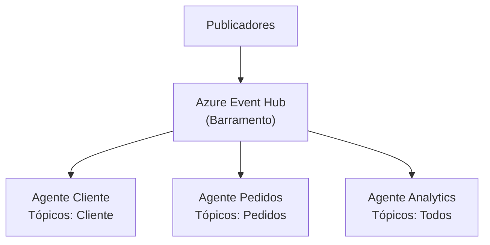

# 🎬 Padrão 3: Publish/Subscribe com Agentes de IA

## 📺 Estilo de Apresentação YouTube

E aí, arquitetos! 🎉 Prontos para o padrão de integração MAIS escalável? Hoje vamos construir **Pub/Sub com assinantes inteligentes de IA**!

## 🎯 Do Que Se Trata o Pub/Sub?

Imagine uma **estação de rádio** 📻:
- **Publicadores** transmitem mensagens (como programas de rádio)
- **Assinantes** sintonizam nos tópicos que lhes interessam
- **Sem conexão direta** entre publicadores e assinantes
- **Todos recebem a mensagem** quem estiver ouvindo!

Agora adicione agentes de IA como assinantes = **MENTE EXPLODIDA** 🤯

## 🏗️ Visão Geral da Arquitetura



## 🔥 O Padrão de Integração Empresarial

**Publish/Subscribe** desacopla sistemas:

1. **Publicadores** - Enviam eventos sem saber quem recebe
2. **Tópicos** - Canais lógicos para diferentes tipos de eventos
3. **Assinantes** - Registram interesse em tópicos específicos
4. **Event Hub** - Roteia mensagens para assinantes interessados
5. **Processamento Paralelo** - Múltiplos agentes processam simultaneamente

### Por Que Este Padrão é Incrível! 🎸

- ✅ **Acoplamento Fraco** - Publicadores não conhecem os assinantes
- ✅ **Escalabilidade** - Adicione assinantes sem alterar publicadores
- ✅ **Flexibilidade** - Assine múltiplos tópicos
- ✅ **Resiliência** - Assinantes podem falhar independentemente
- ✅ **Broadcast** - Uma mensagem alcança muitos assinantes

## 🛠️ Tecnologias Utilizadas

- **Azure Event Hub** - Broker de mensagens Pub/Sub 📬
- **Agentes Azure AI Foundry** - Assinantes inteligentes 🤖
- **Roteamento Baseado em Tópicos** - Entrega inteligente de mensagens 🎯
- **FastAPI + MCP** - API REST com protocolo padronizado ⚡
- **Python Assíncrono** - Processamento concorrente de mensagens 🚀

## 🚀 Início Rápido

### Pré-requisitos

1. Azure Event Hub configurado
2. Projeto Azure AI Foundry
3. Python 3.11+

### Configuração

1. **Navegue:**
```bash
cd src/services/pubsub
```

2. **Configure:**
```bash
cp ../.env.example .env
# Adicione suas credenciais
```

3. **Instale:**
```bash
uv sync
```

### 🏃 Executando

**Opção 1: Demo com Assinantes Pré-configurados**
```bash
python main.py
```

**Opção 2: API REST**
```bash
python api.py
# OU
uvicorn api:app --port 8002 --reload
```

### 🐳 Docker

**Construir:**
```bash
# Produção
docker build -t pubsub-agent --target production .

# Desenvolvimento
docker build -t pubsub-agent-dev --target development .
```

**Executar:**
```bash
# Produção
docker run --env-file .env pubsub-agent

# Desenvolvimento
docker run -p 8002:8002 -v $(pwd):/app/src/services/pubsub --env-file .env pubsub-agent-dev
```

## 📡 Endpoints da API

### Publicar uma Mensagem
```bash
POST /publish
{
  "topic": "customer_events",
  "payload": {
    "event_type": "feedback",
    "customer_id": "C123",
    "rating": 5,
    "comment": "Excelente serviço!"
  }
}
```

### Criar Assinante Personalizado
```bash
POST /subscribers/create
{
  "name": "Agente de Detecção de Fraude",
  "topics": ["order_events"],
  "instructions": "Analisar pedidos em busca de padrões de fraude..."
}
```

### Criar Assinantes Pré-configurados
```bash
POST /subscribers/preset/customer-service
POST /subscribers/preset/order-processor
POST /subscribers/preset/analytics
```

### Listar Assinantes
```bash
GET /subscribers
```

### Iniciar Consumidores de Mensagens
```bash
POST /consumers/start
```

### Listar Tópicos Disponíveis
```bash
GET /topics
```

## 💡 Como Funciona

### 1. Definição de Tópicos
Quatro tipos de tópicos disponíveis:
- `customer_events` - Interações com clientes
- `order_events` - Processamento de pedidos
- `system_events` - Operações do sistema
- `analytics_events` - Analytics de negócios

### 2. Registro de Assinantes
Agentes assinam os tópicos que lhes interessam:
```python
subscriber = AgentSubscriber(
    name="Atendimento ao Cliente",
    subscribed_topics=[TopicType.CUSTOMER_EVENTS],
    processing_instructions="Tratar problemas de clientes..."
)
```

### 3. Publicação de Mensagens
Publicadores enviam para tópicos:
```python
message = Message(
    topic=TopicType.CUSTOMER_EVENTS,
    payload={"customer_id": "C123", ...}
)
await broker.publish(message)
```

### 4. Processamento Inteligente
- Event Hub transmite para todos os assinantes
- Cada agente verifica se está inscrito no tópico
- Agentes interessados processam em paralelo
- Cada um fornece insights únicos da sua perspectiva

## 🎓 Conceitos-Chave

### AgentSubscriber
Assinante alimentado por IA:
- **Assina** tópicos específicos
- **Filtra** mensagens por interesse
- **Processa** usando cognição de IA
- **Rastreia** métricas

### PubSubBroker
Orquestrador de mensagens:
- **Gerencia** registro de assinantes
- **Roteia** mensagens para o Event Hub
- **Coordena** processamento paralelo
- **Trata** falhas de forma graciosa

### Roteamento Baseado em Tópicos
Mensagens fluem com base em tópicos:
```
customer_events → Agente de Atendimento ao Cliente
customer_events → Agente de Analytics
order_events    → Agente de Processamento de Pedidos
order_events    → Agente de Analytics
```

## 📊 Casos de Uso do Mundo Real

Perfeito para:

1. 🎫 **Arquitetura Orientada a Eventos**
   - Microsserviços se comunicam via eventos
   - Cada serviço é um assinante

2. 📊 **Analytics em Tempo Real**
   - Agentes de analytics assinam todos os tópicos
   - Processam eventos para gerar insights

3. 🔔 **Sistemas de Notificação**
   - Diferentes agentes para e-mail, SMS, push
   - Assinam eventos relevantes

4. 🛡️ **Monitoramento de Segurança**
   - Agentes de segurança assinam todos os tópicos
   - Detectam ameaças em tempo real

5. 🔄 **Sincronização de Dados**
   - Múltiplos bancos de dados como assinantes
   - Mantêm-se sincronizados automaticamente

## 🎯 Funcionalidades Avançadas

### Assinatura de Múltiplos Tópicos
Um agente, múltiplos tópicos:
```python
analytics_agent.subscribed_topics = [
    TopicType.CUSTOMER_EVENTS,
    TopicType.ORDER_EVENTS,
    TopicType.SYSTEM_EVENTS,
]
```

### Processamento Paralelo
Múltiplos agentes processam a mesma mensagem:
- Atendimento ao Cliente analisa sentimento
- Analytics extrai métricas
- Detecção de Fraude verifica anomalias

Tudo simultaneamente! ⚡

### Gerenciamento Dinâmico de Assinantes
- Adicione assinantes em tempo de execução
- Remova assinantes sem afetar os demais
- Atualize assinaturas dinamicamente

## 🔐 Melhores Práticas

1. ✅ **Design de Tópicos** - Hierarquia clara e lógica de tópicos
2. ✅ **Idempotência** - Assinantes tratam duplicatas
3. ✅ **Tratamento de Erros** - Falha de um assinante não afeta os outros
4. ✅ **Esquema de Mensagens** - Formato consistente de mensagens
5. ✅ **Monitoramento** - Rastreie saúde e desempenho dos assinantes

## 📈 Monitoramento e Métricas

Rastreie métricas importantes:
- Mensagens publicadas por tópico
- Tempo de processamento dos assinantes
- Taxas de sucesso/falha
- Throughput de mensagens

```python
subscriber_info = {
    "name": subscriber.name,
    "processed_count": subscriber.processed_count,
    "subscribed_topics": subscriber.subscribed_topics,
}
```

## 🆚 Pub/Sub vs Outros Padrões

| Padrão | Acoplamento | Escalabilidade | Caso de Uso |
|--------|-------------|----------------|-------------|
| **Pub/Sub** | Fraco | Alta | Broadcast de eventos |
| **Fila** | Forte | Média | Distribuição de tarefas |
| **Pipes** | Médio | Média | Processamento sequencial |

## 🎬 O Que Vem Aí!

Próximo:
- **Padrão 4**: Mensagens de Comando com pipelines assíncronos
- Documentação completa de arquitetura
- Docker Compose para todos os padrões

## 🙏 Antes de Ir!

- 👍 Curta se aprendeu algo novo
- 💬 Comente seus casos de uso de Pub/Sub
- 📢 Compartilhe com sua equipe
- 🔔 Inscreva-se para o Padrão 4!

---

**🔗 Recursos:**
- [Padrão Pub/Sub](https://www.enterpriseintegrationpatterns.com/patterns/messaging/PublishSubscribeChannel.html)
- [Azure Event Hubs](https://learn.microsoft.com/azure/event-hubs/)
- [Azure AI Foundry](https://learn.microsoft.com/azure/ai-studio/)

**#PubSub #OrientadoAEventos #AzureEventHub #AgentesDeIA #Microsserviços #ArquiteturaCloud**
